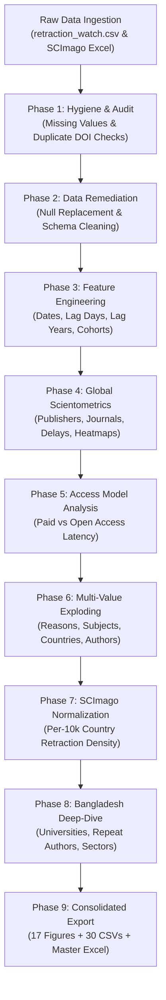

# Retraction Watch EDA & Data Quality Audit: Global Patterns & Bangladesh Case Study

[](https://www.python.org/)
[](https://jupyter.org/)
[](https://pandas.pydata.org/)
[](https://seaborn.pydata.org/)
[](#)
[](#project-artifacts)

A comprehensive exploratory data analysis (EDA), data quality audit, and scientometric investigation of the **Retraction Watch Database** (71,400+ entries) cross-analyzed with national publication output indicators from **SCImago Journal & Country Rank** (1996–2025). This project contrasts macro-level global retraction dynamics with an empirical deep dive into the retraction landscape of **Bangladesh**.

---

## Table of Contents

- [Executive Summary](#executive-summary)
- [Key Research Findings](#key-research-findings)
  - [Global Scientometric Dynamics](#1-global-scientometric-dynamics)
  - [Open Access vs. Paywalled Disparity](#2-open-access-vs-paywalled-disparity)
  - [Bangladesh In-Depth Case Study](#3-bangladesh-in-depth-case-study)
- [Repository Structure](#repository-structure)
- [Methodology & Pipeline](#methodology--pipeline)
- [Artifact Catalog](#artifact-catalog)
  - [Figures (`figures/`)](#visualizations-figures)
  - [Tables (`tables/`)](#tables-tables)
- [Setup & Execution](#setup--execution)
- [Configuration Guide](#configuration-guide)
- [Data Sources & Attributions](#data-sources--attributions)

---

## Executive Summary

Academic retractions serve as a vital self-correcting mechanism in modern science; however, sudden escalations in retraction rates frequently indicate systemic pressures, rogue paper mills, peer-review fraud, or citation cartels. 

This repository provides an automated, reproducible data analysis pipeline implemented in [retraction_watch_eda.py](file:///d:/uni/AIML_503/project/retraction_watch_eda.py) and documented interactively in [retraction_watch_eda.ipynb](file:///d:/uni/AIML_503/project/retraction_watch_eda.ipynb). 

### Scope of Analysis
1. **Data Hygiene & Completeness Audit**: Evaluates null percentages, record collisions, and DOI duplicate anomalies across the full database.
2. **Global Retraction Trajectories**: Evaluates 30+ years of retraction timelines, publication cohort delays, and geographic concentrations.
3. **Publication Access Models**: Measures the latency differences between subscription (paywalled) articles and open-access literature.
4. **Bangladesh Case Study**: Deep-dive audit into 348 retractions from Bangladeshi authors, institutional shares, public vs. private university distributions, repeat authors, foreign partner networks, and primary retraction drivers.

---

## Key Research Findings

### 1. Global Scientometric Dynamics
- **Dataset Scale**: Evaluated 71,400 raw retraction records across global scientific output.
- **Retraction Latency (Lag Time)**:
  - **Median time from publication to retraction**: **1.36 years** (497 days).
  - **Mean time from publication to retraction**: **2.63 years** (959 days).
  - **Interquartile Range**: 25th percentile is **0.42 years** (153 days); 75th percentile is **3.08 years** (1,124 days).
  - Long-tail outliers extend past a decade, underscoring post-publication surveillance delays.
- **Top Retraction Drivers Globally**:
  - *Investigation by Journal/Publisher* (44.1%)
  - *Unreliable Results and/or Conclusions* (30.3%)
  - *Concerns/Issues about Referencing/Attributions* (21.2%)
  - *Paper Mills* (16.5%)
  - *Concerns/Issues about Peer Review* (16.3%)

### 2. Open Access vs. Paywalled Disparity
- **Access Model Breakdown**: Open-access retractions account for **60.3%** of classified retractions, while paywalled articles represent **39.7%**.
- **Latency Acceleration**:
  - **Paywalled articles**: Median retraction delay is **0.52 years** (with **71.7%** retracted within < 1 year).
  - **Open-access articles**: Median retraction delay is **1.38 years** (with only **41.3%** retracted within < 1 year).
  - *Insight*: Subscription articles trigger faster legal and copyright interventions, whereas open-access post-publication scrutiny often requires sustained community whistleblowing (e.g., PubPeer).

### 3. Bangladesh In-Depth Case Study
- **Volume & Global Share**: 348 retracted papers involve authors affiliated with institutions in Bangladesh (**0.49%** of the global retraction database).
- **Global Density Ranking**:
  - SCImago Global Publication Output Rank: **Rank 59** (147,613 total papers, 136,208 citable).
  - **Retraction Rate**: **23.58 retractions per 10,000 published papers** (0.2358%).
  - Global Retraction Rate Rank: **#24 globally** among nations with $\ge$ 1,000 documents, ranking alongside high-scrutiny output countries.
- **Surge Period (2020–2024)**: Over 70% of all retractions tied to Bangladesh occurred after 2020, aligned with the mass-clearing of compromised special issues by major publishers.
- **Distinct Retraction Drivers (BD vs. Global Benchmark)**:
  - *Unreliable Results / Conclusions*: **62.9%** BD vs. **30.3%** Global (+32.7% delta).
  - *Investigation by Journal / Publisher*: **74.1%** BD vs. **44.1%** Global (+30.0% delta).
  - *Citation / Reference Manipulation*: **43.1%** BD vs. **21.2%** Global (+21.9% delta).
  - *Computer-Generated / AI-assisted Fraud*: **24.7%** BD vs. **12.8%** Global (+11.9% delta).
  - *Paper Mill Involvement*: **26.4%** BD vs. **16.5%** Global (+9.9% delta).
- **Institutional Distribution**:
  - **Private Universities**: Account for **58.9%** of institutional retraction instances (led by Daffodil International University and North South University).
  - **Public Universities / Medical**: Account for **37.6%** (led by University of Dhaka, Jahangirnagar University, and public engineering universities).
  - **Joint Collaborations**: **3.4%**.
- **International Collaboration**:
  - **52.6%** of Bangladeshi retracted papers involved international co-authorship.
  - Top foreign collaborator countries: **Malaysia**, **Saudi Arabia**, **China**, **India**, **Australia**, **South Korea**, and the **USA**.
- **Hyper-Authorship & Repeat Authors**:
  - Mean author team size in Bangladesh is **5.41 authors/paper** (compared to **4.32 authors/paper** globally).
  - Top single author is linked to **16 distinct retractions**, revealing clustered author syndicates.

---

## Repository Structure

```text
aiml503-project/
├── retraction_watch_eda.py                     # Centralized, production-grade Python EDA pipeline
├── retraction_watch_eda.ipynb                  # Interactive Jupyter Notebook with visualization outputs
├── retraction_watch.csv                        # Primary Retraction Watch Database extract (71,400+ rows)
├── scimagojr country rank 1996-2025.xlsx       # SCImago Country Ranks & total publication counts
├── figures/                                    # 17 Publication-quality visualization figures (300 DPI PNG)
│   ├── 01_missing_values_percentage.png
│   ├── 02_time_to_retraction_distribution.png
│   ├── 03_temporal_trajectory_and_matrix_heatmap.png
│   ├── 04_cohort_retraction_delay_breakdown.png
│   ├── 05_top_15_retraction_reasons.png
│   ├── 06_top_15_countries_retraction_volume.png
│   ├── 07_country_retraction_rates_and_bangladesh_rank.png
│   ├── 08_top_publishers_and_journals.png
│   ├── 09_paywalled_vs_open_access_comparison.png
│   ├── 10_bangladesh_annual_trend_and_delay_kde.png
│   ├── 11_bangladesh_top_universities.png
│   ├── 12_bangladesh_top_retraction_reasons.png
│   ├── 13_bangladesh_vs_global_benchmarks.png
│   ├── 14_bangladesh_top_subjects_and_publishers.png
│   ├── 15_bangladesh_international_collaboration_network.png
│   ├── 16_bangladesh_hyper_authorship_and_top_authors.png
│   └── 17_bangladesh_journals_and_sector_breakdown.png
├── tables/                                     # 30 Analytical CSV summary tables + Consolidated Excel
│   ├── all_retraction_watch_eda_tables.xlsx    # Master Excel Workbook with 28 tabbed analytical sheets
│   ├── 01_missing_values_breakdown.csv
│   ├── 02_duplication_analysis_summary.csv
│   ├── 03_data_cleaning_remediation_summary.csv
│   ├── ...                                     # Individual analytical CSV tables (04 through 30)
│   └── 30_bangladesh_university_sector_breakdown.csv
├── retraction_watch_eda_report_ieee_v2.docx    # Formal IEEE-style research report document
├── 503.docx                                    # Project documentation and writeup
└── .gitignore                                  # Git exclusion configuration
```

---

## Methodology & Pipeline

The pipeline in [`retraction_watch_eda.py`](file:///d:/uni/AIML_503/project/retraction_watch_eda.py) executes a sequential 9-phase analytical process:



### Key Technical Implementations
- **Entity Resolution for Bangladeshi Universities**: Implements [`normalize_bd_university()`](file:///d:/uni/AIML_503/project/retraction_watch_eda.py#L176-L212) using compiled regular expressions to strip campus addresses, postal codes, and departmental sub-strings, aggregating campus-wide outputs correctly.
- **Sector Classification**: Utilizes [`classify_paper_sector()`](file:///d:/uni/AIML_503/project/retraction_watch_eda.py#L236-L250) to categorize Bangladeshi institutions into *Public Universities / Medical*, *Private Universities*, or *Joint Public-Private*.
- **International Collaboration Detection**: Employs [`check_intl_collab()`](file:///d:/uni/AIML_503/project/retraction_watch_eda.py#L214-L227) by parsing semicolon-delimited author affiliation country strings.
- **Cohort Latency Binning**: Categorizes time-to-retraction into standardized duration windows (`< 1 Year`, `1 to 3 Years`, `3 to 5 Years`, `> 5 Years`).

---

## Artifact Catalog

### Visualizations (`figures/`)

| # | Figure File | Topic / Description |
|---|-------------|---------------------|
| 01 | [`01_missing_values_percentage.png`](file:///d:/uni/AIML_503/project/figures/01_missing_values_percentage.png) | Data completeness and null breakdown across all database attributes. |
| 02 | [`02_time_to_retraction_distribution.png`](file:///d:/uni/AIML_503/project/figures/02_time_to_retraction_distribution.png) | Histogram with KDE and Box Plot of publication-to-retraction latency (years). |
| 03 | [`03_temporal_trajectory_and_matrix_heatmap.png`](file:///d:/uni/AIML_503/project/figures/03_temporal_trajectory_and_matrix_heatmap.png) | Annual trend lines and 2D correlation matrix heatmap (Orig Year vs. Retraction Year). |
| 04 | [`04_cohort_retraction_delay_breakdown.png`](file:///d:/uni/AIML_503/project/figures/04_cohort_retraction_delay_breakdown.png) | Stacked bar chart showing retraction delay category proportions by cohort (2012–2024). |
| 05 | [`05_top_15_retraction_reasons.png`](file:///d:/uni/AIML_503/project/figures/05_top_15_retraction_reasons.png) | Global frequency count of the top 15 primary retraction justifications. |
| 06 | [`06_top_15_countries_retraction_volume.png`](file:///d:/uni/AIML_503/project/figures/06_top_15_countries_retraction_volume.png) | Absolute volume of retractions for the top 15 participating countries. |
| 07 | [`07_country_retraction_rates_and_bangladesh_rank.png`](file:///d:/uni/AIML_503/project/figures/07_country_retraction_rates_and_bangladesh_rank.png) | Retractions per 10,000 papers for top publishing nations & global ranks down to Bangladesh. |
| 08 | [`08_top_publishers_and_journals.png`](file:///d:/uni/AIML_503/project/figures/08_top_publishers_and_journals.png) | Bar charts of top 10 publishing houses and academic journals by retraction count. |
| 09 | [`09_paywalled_vs_open_access_comparison.png`](file:///d:/uni/AIML_503/project/figures/09_paywalled_vs_open_access_comparison.png) | 4-panel comparison: access model share, nature, KDE delay distributions, and lag bins. |
| 10 | [`10_bangladesh_annual_trend_and_delay_kde.png`](file:///d:/uni/AIML_503/project/figures/10_bangladesh_annual_trend_and_delay_kde.png) | Dual-axis annual trajectory (BD vs. Global), annual global share %, and delay KDE. |
| 11 | [`11_bangladesh_top_universities.png`](file:///d:/uni/AIML_503/project/figures/11_bangladesh_top_universities.png) | Top 12 Bangladeshi universities ranked by normalized retraction frequency. |
| 12 | [`12_bangladesh_top_retraction_reasons.png`](file:///d:/uni/AIML_503/project/figures/12_bangladesh_top_retraction_reasons.png) | Most frequent reasons cited for retracted papers involving Bangladeshi affiliations. |
| 13 | [`13_bangladesh_vs_global_benchmarks.png`](file:///d:/uni/AIML_503/project/figures/13_bangladesh_vs_global_benchmarks.png) | Side-by-side grouped benchmarking of retraction reasons and lag cohorts (BD vs. Global). |
| 14 | [`14_bangladesh_top_subjects_and_publishers.png`](file:///d:/uni/AIML_503/project/figures/14_bangladesh_top_subjects_and_publishers.png) | Dominant academic disciplines and primary commercial publishers for BD retractions. |
| 15 | [`15_bangladesh_international_collaboration_network.png`](file:///d:/uni/AIML_503/project/figures/15_bangladesh_international_collaboration_network.png) | Donut chart of collaboration types and bar chart of top foreign co-author nations. |
| 16 | [`16_bangladesh_hyper_authorship_and_top_authors.png`](file:///d:/uni/AIML_503/project/figures/16_bangladesh_hyper_authorship_and_top_authors.png) | Team size boxplot comparison (BD vs. Global) and top repeat-retracted authors in BD. |
| 17 | [`17_bangladesh_journals_and_sector_breakdown.png`](file:///d:/uni/AIML_503/project/figures/17_bangladesh_journals_and_sector_breakdown.png) | Top 10 retracting journals and pie chart of institutional sectors (Public vs Private). |

---

### Tables (`tables/`)

All generated analytical tables are exported as standardized CSV files in [`tables/`](file:///d:/uni/AIML_503/project/tables) and bundled into the consolidated multi-sheet workbook [`all_retraction_watch_eda_tables.xlsx`](file:///d:/uni/AIML_503/project/tables/all_retraction_watch_eda_tables.xlsx):

- **Data Quality & Audit**:
  - `01_missing_values_breakdown.csv`: Column-level null metrics and percentages.
  - `02_duplication_analysis_summary.csv`: Full row, Record ID, Title, and DOI collision counts.
  - `03_data_cleaning_remediation_summary.csv`: Step-by-step attrition table.
  - `04_engineered_features_summary_stats.csv`: Descriptive summary statistics for engineered date attributes.
- **Global Patterns & Benchmarks**:
  - `05_retraction_delay_quantiles.csv`: Key latency quartiles and mean values.
  - `06_annual_publication_vs_retraction_trends.csv`: Year-over-year global publication vs. retraction counts.
  - `07_retraction_matrix_2012_2026.csv`: Original year vs. Retraction year cross-tabulation.
  - `08_cohort_retraction_delay_counts.csv`: Duration cohort breakdowns across 2012–2024.
  - `09_top_15_retraction_reasons.csv`: Global frequency ranking of retraction reasons.
  - `10_top_15_countries_retraction_volume.csv`: Raw publication counts by top nations.
  - `11_top_15_publishing_nations_retraction_rates.csv`: Retraction rates for highest-output nations.
  - `12_highest_retraction_rate_nations_till_bangladesh.csv`: Top nations by per-10,000 document retraction density down to Bangladesh.
  - `13_all_countries_scimago_merged_retraction_rates.csv`: Complete global merged ranking.
  - `14_top_10_publishers.csv`: Major publishing houses by volume of retractions.
  - `15_top_10_journals.csv`: Scholarly journals with the highest retraction counts.
  - `16_paywalled_vs_open_access_summary.csv`: Statistical performance summary by access model.
  - `17_paywalled_lag_category_percentages.csv`: Duration distribution percentages by access model.
- **Bangladesh In-Depth Case Study**:
  - `18_bangladesh_publication_and_retraction_metrics.csv`: Macro summary metrics (retraction rate, rank, counts).
  - `19_bangladesh_annual_retraction_trend.csv`: Annual progression of Bangladeshi retractions.
  - `20_bangladesh_top_universities.csv`: Affiliated university counts (normalized).
  - `21_bangladesh_top_retraction_reasons.csv`: Retraction reason frequencies in Bangladesh.
  - `22_bangladesh_vs_global_reasons_comparison.csv`: Difference delta table (% BD vs. % Global).
  - `23_bangladesh_vs_global_lag_cohort_comparison.csv`: Lag distribution benchmarking.
  - `24_bangladesh_top_subjects.csv`: Subject discipline breakdown.
  - `25_bangladesh_top_publishers.csv`: Retraction frequency by publisher.
  - `26_bangladesh_annual_vs_global_comparison.csv`: Comparative annual trends and global percentage shares.
  - `27_bangladesh_foreign_collaboration_partners.csv`: Co-affiliated international partner countries.
  - `28_bangladesh_top_repeat_authors.csv`: Prolific repeat-retracted researchers.
  - `29_bangladesh_top_retracting_journals.csv`: Outlets retracting Bangladeshi works.
  - `30_bangladesh_university_sector_breakdown.csv`: Institutional sector distribution.

---

## Setup & Execution

### 1. Prerequisites
Ensure you have Python 3.10+ installed.

### 2. Install Required Packages
Install the required analytical and plotting libraries:

```bash
pip install pandas numpy matplotlib seaborn openpyxl
```

### 3. Run the Automated Pipeline
Execute the main script from the project root:

```bash
python retraction_watch_eda.py
```

*The pipeline will process the datasets, execute data cleaning, generate all 17 figures into `figures/`, output 30 CSV tables and the consolidated `all_retraction_watch_eda_tables.xlsx` into `tables/`, and print an execution manifest to the terminal.*

### 4. Interactive Jupyter Notebook
To explore the analysis step-by-step and inspect code cells interactively:

```bash
jupyter notebook retraction_watch_eda.ipynb
```

---

## Configuration Guide

The execution pipeline in [`retraction_watch_eda.py`](file:///d:/uni/AIML_503/project/retraction_watch_eda.py#L24-L122) contains a centralized configuration block:

```python
# --- Visualization Settings ---
FIGURE_DPI = 300
PLOT_STYLE = "seaborn-v0_8-whitegrid"
SHOW_PLOTS = False  # Set to True to display interactive GUI plot windows

# --- Color Palettes ---
COLOR_BD = "#006a4e"       # Bangladesh Primary Green
COLOR_GLOBAL = "#2b5c8f"   # Global Baseline Slate Blue
COLOR_CHINA = "#d95f02"    # China Accent Orange
COLOR_ALERT = "#c0392b"    # Alert Crimson

# --- Thresholds & Filters ---
MIN_SCIMAGO_DOCUMENTS = 1000  # Minimum documents published to calculate country rank
TOP_N_REASONS = 15
TOP_N_COUNTRIES = 15
TOP_N_BD_UNIVERSITIES = 12
```

To modify output resolution, palettes, or top-$N$ thresholds, edit the settings directly in the header of [`retraction_watch_eda.py`](file:///d:/uni/AIML_503/project/retraction_watch_eda.py).

---

## Data Sources & Attributions

1. **Retraction Watch Database**: Provided by The Center for Scientific Integrity ([Retraction Watch](https://retractionwatch.com/)). Primary data file: [`retraction_watch.csv`](file:///d:/uni/AIML_503/project/retraction_watch.csv).
2. **SCImago Journal & Country Rank**: Data derived from Scopus® (Elsevier B.V.), spanning national publication output from 1996 to 2025. Primary data file: [`scimagojr country rank 1996-2025.xlsx`](file:///d:/uni/AIML_503/project/scimagojr%20country%20rank%201996-2025.xlsx).

---
